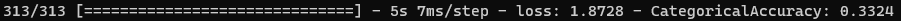

# Tensorflow Keras Boilerplate

Tensorflow Keras Boilerplate using Tensorflow GPU

## Requirement

- Tensorflow GPU (2.9.1)
- pydot (1.4.2)
- Graphviz (2.42.2)

```shell
pip install pydot
sudo apt install graphviz
```

## Train

```
python Train.py
```


## Test

> Need `Train` step

```shell
python Test.py
```




## Predict

> Need `Train`, `Test` step

```shell
python Predict.py
```


## Tensorboard

> Need `Train` step

```shell
tensorboard --logdir=logs --host=0.0.0.0 --port=6006
```


